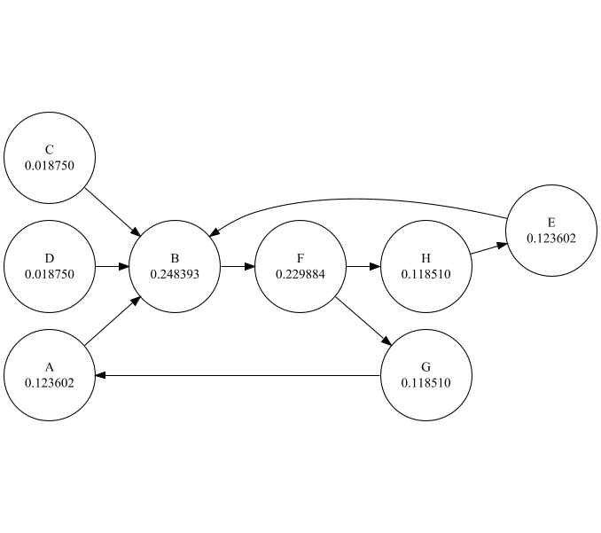

# PageRank Calculator

A simple Java-based PageRank calculator that allows users to compute PageRank scores for a directed graph. The graph can be provided manually or loaded from a file. The program also generates a Graphviz DOT file for visualizing the graph.

## Features

- **Input Options**: 
  - Manual input via the console.
  - Load the graph from a file.

- **PageRank Algorithm**: 
  - Uses damping factor (default: `0.85`).
  - Iterates until convergence or a maximum of 100 iterations.
  - Includes random jumps for disconnected nodes.

- **Visualization**: 
  - Generates a `pagerank_graph.dot` file for Graphviz visualization.

## How It Works

1. **Graph Input**:
   - The graph is represented as a list of directed edges.
   - For example:
`A->B
 B->F
 F->G,H
 G->A
 H->E
 E->B
 C->B
 D->B` 

2. **PageRank Calculation**:
   - Initializes all nodes with equal rank.
   - Iteratively distributes rank among nodes based on incoming edges.
   - Stops when rank changes converge within a threshold.

3. **Output**:
   - Displays PageRank scores for all nodes.
   - Optionally generates a DOT file for visualization.
     
## Visualization Example

Here’s an example graph visualization generated from the DOT file:

# Contributors 
* [Agnesa Rama](https://github.com/agnesarama1)
* [Afrim Ymeri](https://github.com/afrimymeri)
* [Brilant Ponxhaj](https://github.com/BrilantP)
* [Haki Pintolli](https://github.com/HakiPintolli)
